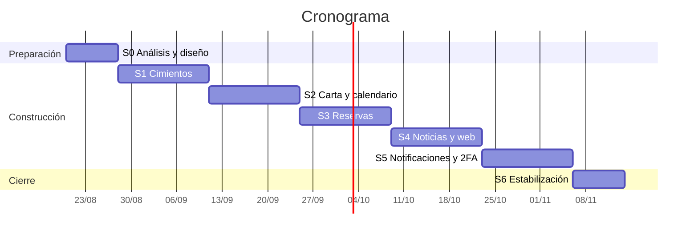

# Plan de sprints — 28 de agosto al 13 de noviembre de 2026

### App móvil — El Encanto Campestre

**Versión:** 0.2 · **Actualizado:** 20 de agosto de 2026 · Complementa a `Sprint0_Analisis_y_Diseno.md`

---

## 1. Calendario

Cinco sprints de dos semanas más uno de cierre de ocho días. Inician viernes y cierran jueves: revisión y retrospectiva el jueves, planificación el viernes.

| Sprint | Inicio     | Cierre     | Foco                                            |
| ------ | ---------- | ---------- | ----------------------------------------------- |
| **0**  | jue 20 ago | jue 27 ago | Análisis, diseño y preparación                  |
| **1**  | vie 28 ago | jue 10 sep | Cimientos: entorno, datos, autenticación e i18n |
| **2**  | vie 11 sep | jue 24 sep | Carta, fotos y calendario de atención           |
| **3**  | vie 25 sep | jue 8 oct  | Reservas: aforo, pedido opcional y aprobación   |
| **4**  | vie 9 oct  | jue 22 oct | Noticias, capa web y deep links                 |
| **5**  | vie 23 oct | jue 5 nov  | Notificaciones, segundo factor y refinamiento   |
| **6**  | vie 6 nov  | vie 13 nov | Estabilización y sustentación                   |

**Capacidad.** Tres integrantes, ~26 h/semana en conjunto → ~52 h por sprint. La velocidad en puntos es desconocida hasta cerrar el Sprint 1; los totales de abajo son hipótesis y conviene recalibrarlos con el dato real.

**Ceremonias.** Planificación el viernes de inicio · sincronización dos veces por semana · revisión y retrospectiva el jueves de cierre · **recorrido de código** el jueves de cierre, donde cada integrante explica un módulo del sprint. Esta última es la preparación directa para los parciales.

---

## 2. Sprint 0 — hasta el 27 de agosto

| Estado | Entregable                                                                                | Responsable |
| :----: | ----------------------------------------------------------------------------------------- | ----------- |
|  [x]   | Documento de análisis y diseño (`Sprint0_Analisis_y_Diseno.md`)                           | Equipo      |
|  [x]   | Modelo de datos y diagrama entidad-relación                                               | Equipo      |
|  [x]   | ADR-001 a ADR-010 aprobados                                                               | Equipo      |
|  [x]   | Registro de decisiones con el cliente (`Decisiones_Pendientes_y_Riesgos.md`)              | Yeison      |
|  [x]   | Fichas de diseño y tokens (`tokens.json`, `tokens.css`)                                   | Alex        |
|  [x]   | Biblioteca de componentes (29 componentes en 7 lotes)                                     | Fabián      |
|  [x]   | Wireframes y 5 pantallas clave de alta fidelidad (`P-01`, `P-02`, `P-07`, `P-09`, `P-22`) | Yeison      |
|  [ ]   | Monorepo creado en disco y estructura base de carpetas                                    | Alex        |
|  [ ]   | Tablero de Jira configurado con el backlog cargado (`Backlog_Jira.csv`)                   | Yeison      |
|  [ ]   | Entorno de desarrollo nativo verificado en las tres máquinas                              | Equipo      |
|  [ ]   | Proyecto de Supabase creado y VPS aprovisionada                                           | Fabián      |

**Cierre.** Cualquier integrante ejecuta `npm run android` sobre un proyecto vacío y se conecta a la API local.

---

## 3. Sprint 1 — Cimientos · 28 ago al 10 sep

**Objetivo.** Los tres proyectos ejecutándose de extremo a extremo, con un usuario capaz de registrarse e iniciar sesión.

|  Estado   | Tarea                                                                                    | Requisitos       |  Pts   | Responsable |
| :-------: | ---------------------------------------------------------------------------------------- | ---------------- | :----: | ----------- |
|    [x]    | Monorepo, convenciones de commits, packages/shared (Zod) y CI mínima                     | RNF-14           |   3    | Yeison      |
|    [x]    | React Native 0.87 bare con Nueva Arquitectura, TypeScript y navegación de 5 tabs         | §13.1            |   8    | Yeison      |
|    [x]    | i18n con `i18next` y archivos de recursos desde el primer commit                         | RNF-03, ADR-009  |   3    | Yeison      |
|    [ ]    | NestJS en contenedor Docker, Swagger en `/api/docs` y manejo centralizado de excepciones | RNF-12, ADR-008  |   5    | Alex        |
|    [x]    | Esquema de Prisma completo (18 entidades) y primera migración en Supabase                | §9               |   8    | Fabián      |
|    [x]    | Datos de siembra (seed): restaurante, zonas, mesas, categorías, platos y calendario      | —                |   3    | Fabián      |
|    [ ]    | Registro, inicio de sesión, refresco y cierre de sesión con Argon2id                     | RF-AUT01, 03, 04 |   8    | Alex        |
|    [ ]    | Token de refresco en Keystore (`react-native-keychain`) e interceptor de renovación      | RNF-06           |   5    | Yeison      |
|    [x]    | `RolesGuard` y protección de rutas por rol en backend                                    | RNF-08           |   3    | Fabián      |
|    [ ]    | Despliegue del contenedor en la VPS con HTTPS                                            | ADR-008          |   5    | Alex        |
| **Total** |                                                                                          |                  | **51** |             |

**Si hay que recortar:** el despliegue en VPS puede correrse al Sprint 2, siempre que quede antes de que existan tareas programadas.

**Riesgos.** La configuración del entorno nativo de Android suele consumir más de lo previsto: conviene resolverla en los primeros tres días y documentarla. Prisma con Supabase requiere distinguir la cadena agrupada de la directa para migraciones.

**Guion para el parcial.** ¿Qué diferencia hay entre el puente clásico y la comunicación vía JSI? ¿Por qué el token de acceso es corto y el de refresco rotatorio? ¿Dónde vive la autorización y por qué no basta con ocultar botones?

**Cierre.** Un usuario se registra, inicia sesión, cierra la aplicación, la reabre y conserva la sesión.

---

## 4. Sprint 2 — Carta y calendario · 11 al 24 sep

**Objetivo.** Que el comensal vea la carta real del próximo día de atención y que el dueño pueda mantenerla.

|  Estado   | Tarea                                                                                 | Requisitos         |  Pts   | Responsable |
| :-------: | ------------------------------------------------------------------------------------- | ------------------ | :----: | ----------- |
|    [ ]    | Carta por categorías con lista virtualizada en React Native                           | RF-MEN01, RF-MEN06 |   8    | Yeison      |
|    [ ]    | Pantalla de inicio con los platos del próximo día de atención                         | RF-MEN02           |   5    | Yeison      |
|    [ ]    | Detalle de plato con galería de hasta 10 fotos                                        | RF-MEN03           |   5    | Yeison      |
|    [ ]    | API de menú: categorías, platos, etiquetas y disponibilidad                           | RF-MEN01–06        |   5    | Alex        |
|    [ ]    | Administración de categorías y platos en backend y móvil                              | RF-ADM01, 02, 04   |   8    | Fabián      |
|    [ ]    | Carga de fotos: compresión con `sharp`, Supabase Storage y variante para vista previa | RF-ADM02, C-7      |   8    | Alex        |
|    [ ]    | Disponibilidad de platos por fecha: administración y consulta                         | RF-ADM03, ADR-010  |   8    | Fabián      |
|    [ ]    | Calendario de atención: reglas semanales y excepciones por fecha                      | RF-ADM06, HU-05    |   8    | Fabián      |
|    [ ]    | Pruebas de disponibilidad de plato por fecha                                          | RNF-12             |   3    | Alex        |
| **Total** |                                                                                       |                    | **58** |             |

**Si hay que recortar:** búsqueda, filtros, favoritos y caché sin conexión ya están fuera de este sprint (van al 5). Si aun así excede, el calendario de atención puede pasar al inicio del Sprint 3, donde de todos modos se consume.

**Nota técnica.** Generar aquí la variante de 1200×630 px por debajo de 600 KB evita rehacer el flujo de carga en el Sprint 4.

**Guion para el parcial.** ¿Por qué una lista virtualizada y qué pasa con la memoria sin ella? ¿Qué aporta TanStack Query frente a `useEffect` con `fetch`? ¿Cómo se resuelve la precedencia entre la disponibilidad por fecha y la general?

**Cierre.** El dueño crea un plato con fotos desde el teléfono, lo habilita solo para el domingo siguiente, y el comensal lo ve al consultar esa fecha.

---

## 5. Sprint 3 — Reservas · 25 sep al 8 oct

**Objetivo.** Flujo completo de solicitud, aprobación y operación del servicio. Es el sprint de mayor densidad técnica, aunque bastante más liviano que en la versión anterior del plan gracias al cambio a aforo por franja (ADR-005).

|  Estado   | Tarea                                                                        | Requisitos                 |  Pts   | Responsable |
| :-------: | ---------------------------------------------------------------------------- | -------------------------- | :----: | ----------- |
|    [ ]    | Cálculo de franjas a partir del calendario, la duración y la granularidad    | RF-RES01, 02, 17           |   8    | Alex        |
|    [ ]    | Validación de aforo en transacción serializable                              | RF-RES02, ADR-005          |   5    | Alex        |
|    [ ]    | Flujo de reserva en cuatro pasos: fecha, franja, pedido opcional, resumen    | RF-RES03–06                |   13   | Yeison      |
|    [ ]    | Cálculo del total y generación del ticket copiable                           | RF-RES05, RF-RES18         |   5    | Yeison      |
|    [ ]    | Pantalla de solicitud enviada con instrucciones de pago y acción de WhatsApp | RF-RES07                   |   3    | Yeison      |
|    [ ]    | Bandeja de solicitudes con aprobación y rechazo con motivo                   | RF-RES09, RF-ADM08, 11, 12 |   8    | Fabián      |
|    [ ]    | Máquina de estados con validación de transiciones                            | §9.4                       |   5    | Fabián      |
|    [ ]    | Mis reservas, detalle y cancelación                                          | RF-RES11, RF-RES12         |   5    | Yeison      |
|    [ ]    | Agenda del día y marcado de llegada                                          | RF-ADM09, RF-ADM10         |   5    | Fabián      |
|    [ ]    | Pruebas de aforo y de transiciones de estado                                 | RNF-12                     |   5    | Alex        |
| **Total** |                                                                              |                            | **62** |             |

**Si hay que recortar:** la agenda del día puede pasar al Sprint 5 sin romper el flujo, y la cancelación puede diferirse una semana. Conviene decidirlo en la planificación, no a mitad del sprint.

**Riesgos.** La generación asistida tiende a producir verificaciones de aforo en memoria que fallan bajo concurrencia: revisar de forma explícita que la lectura y la inserción ocurran en la misma transacción con aislamiento serializable. Y el paso de pedido debe filtrar por la fecha elegida, no por la del día actual: es un error fácil y conviene cubrirlo con una prueba.

**Guion para el parcial.** ¿Cómo se generan las franjas y cuál es su costo? ¿Por qué una lectura seguida de una escritura permite superar el aforo sin aislamiento adecuado? ¿Por qué las transiciones se validan en el servicio de dominio y no en el controlador?

**Cierre.** Un comensal solicita reserva con pedido, el dueño la aprueba desde su teléfono y copia el ticket con formato legible.

---

## 6. Sprint 4 — Noticias, web y deep links · 9 al 22 oct

**Objetivo.** Que el restaurante pueda comunicar, y que un plato compartido por WhatsApp se vea con su fotografía.

|  Estado   | Tarea                                                                 | Requisitos         |  Pts   | Responsable |
| :-------: | --------------------------------------------------------------------- | ------------------ | :----: | ----------- |
|    [ ]    | Muro de noticias y detalle en la app móvil                            | RF-NOT01, RF-NOT02 |   5    | Yeison      |
|    [ ]    | Administración de noticias: crear, editar, publicar, fijar            | RF-NOT03, RF-NOT04 |   8    | Fabián      |
|    [ ]    | Capa web en Next.js con `/plato/[slug]` renderizado en servidor       | RF-INF04, ADR-004  |   8    | Alex        |
|    [ ]    | Metadatos Open Graph con imagen versionada y verificación             | RF-INF04           |   5    | Alex        |
|    [ ]    | Despliegue de web en Vercel con dominio y HTTPS                       | —                  |   3    | Alex        |
|    [ ]    | Acción de compartir en el detalle del plato                           | RF-INF04           |   3    | Yeison      |
|    [ ]    | Android App Links: `assetlinks.json`, `intent-filter` y verificación  | RF-INF05           |   8    | Yeison      |
|    [ ]    | Enrutamiento de enlaces entrantes hacia el detalle del plato          | RF-INF05           |   5    | Yeison      |
|    [ ]    | Pantalla "Próximamente" con tarjetas de motos y pesca                 | RF-INF06           |   3    | Fabián      |
|    [ ]    | Información del restaurante con mapa MapLibre y contacto por WhatsApp | RF-INF01–03        |   5    | Fabián      |
| **Total** |                                                                       |                    | **53** |             |

**Riesgos.** La verificación de App Links depende de que la huella SHA-256 del certificado coincida con `assetlinks.json`; depuración y publicación usan certificados distintos, así que hay que registrar ambas huellas. WhatsApp cachea las vistas previas durante días: para las pruebas conviene usar slugs nuevos en lugar de reutilizar el mismo enlace.

**Guion para el parcial.** ¿Por qué la vista previa exige renderizado en servidor? ¿Qué es un App Link y en qué se diferencia de un esquema de URL personalizado? ¿Qué restricciones de imagen impone WhatsApp y cómo se resolvieron?

**Cierre.** Un plato compartido a un contacto se ve con fotografía y, al pulsarlo, abre la aplicación en su detalle.

---

## 7. Sprint 5 — Notificaciones y refinamiento · 23 oct al 5 nov

**Objetivo.** Cerrar lo transversal y elevar la calidad percibida.

|  Estado   | Tarea                                                                    | Requisitos         |  Pts   | Responsable |
| :-------: | ------------------------------------------------------------------------ | ------------------ | :----: | ----------- |
|    [ ]    | FCM y registro de dispositivo                                            | RF-INF07           |   5    | Alex        |
|    [ ]    | Aviso al dueño de solicitud nueva, por push y correo, con la app cerrada | RF-RES08           |   8    | Alex        |
|    [ ]    | Notificación de aprobación y de rechazo al comensal                      | RF-RES10           |   3    | Alex        |
|    [ ]    | Recordatorio programado antes de la reserva                              | RF-RES14           |   5    | Fabián      |
|    [ ]    | Expiración de solicitudes sin aprobar y marcado de inasistencia          | RF-RES13, RF-RES14 |   5    | Fabián      |
|    [ ]    | Preferencias de notificación por tipo en perfil                          | RF-INF08           |   3    | Yeison      |
|    [ ]    | Segundo factor TOTP y guardia de acciones sensibles                      | RF-AUT06, RF-AUT07 |   8    | Fabián      |
|    [ ]    | Verificación de correo y recuperación de contraseña con Resend           | RF-AUT02, RF-AUT05 |   5    | Alex        |
|    [ ]    | Búsqueda, filtros y favoritos                                            | RF-MEN04, 05, 07   |   8    | Yeison      |
|    [ ]    | Caché de carta sin conexión con MMKV                                     | RF-MEN08           |   3    | Yeison      |
|    [ ]    | Adición de platos a reserva aprobada                                     | RF-RES15           |   5    | Yeison      |
|    [ ]    | Estados vacíos, de carga (esqueleto) y de error en toda la aplicación    | RNF-09             |   5    | Yeison      |
| **Total** |                                                                          |                    | **63** |             |

**Si hay que recortar:** la adición de platos (RF-RES15), la caché sin conexión y los indicadores del dueño (RF-ADM13, ya fuera) son lo primero en diferirse.

**Guion para el parcial.** ¿Cómo llega una notificación desde el servidor hasta la bandeja del dispositivo con la app cerrada? ¿Qué es TOTP y por qué el código cambia cada treinta segundos? ¿Por qué el recordatorio se programa en el servidor y no en el dispositivo?

**Cierre.** Una solicitud nueva llega al teléfono del dueño con la aplicación cerrada; al aprobarla, el comensal recibe la confirmación.

---

## 8. Sprint 6 — Estabilización y sustentación · 6 al 13 nov

Congelación de funcionalidad nueva desde el 6 de noviembre.

| Estado | Entregable                                                                             | Responsable |
| :----: | -------------------------------------------------------------------------------------- | ----------- |
|  [ ]   | Pruebas de recorrido completo sobre al menos dos dispositivos físicos                  | Equipo      |
|  [ ]   | Corrección de defectos priorizada por severidad                                        | Equipo      |
|  [ ]   | Medición de requisitos no funcionales: tiempos, tamaño del paquete, memoria            | Alex        |
|  [ ]   | APK firmada con instrucciones de instalación, publicada también en la web              | Yeison      |
|  [ ]   | Documentación final: README por proyecto, OpenAPI exportado, diagrama de despliegue    | Fabián      |
|  [ ]   | Manual breve para el comensal y para el dueño                                          | Yeison      |
|  [ ]   | Sesión de validación con el cliente                                                    | Equipo      |
|  [ ]   | Presentación de sustentación y diapositivas                                            | Equipo      |
|  [ ]   | Repaso técnico: cada integrante prepara la explicación de dos módulos que no construyó | Equipo      |

**Cierre.** El dueño instala la aplicación, publica una noticia y aprueba una reserva sin acompañamiento.

---

## 9. Trazabilidad

| Sprint | Requisitos                                                                                                        |
| ------ | ----------------------------------------------------------------------------------------------------------------- |
| 1      | RF-AUT01, 03, 04, 08 · RNF-03, 05, 06, 07, 08, 12, 14                                                             |
| 2      | RF-MEN01, 02, 03, 06 · RF-ADM01, 02, 03, 04, 06 · RNF-01                                                          |
| 3      | RF-RES01–07, 09, 11, 12, 17, 18 · RF-ADM08, 09, 10, 11, 12 · RNF-02                                               |
| 4      | RF-NOT01–04, 06 · RF-INF01–06                                                                                     |
| 5      | RF-AUT02, 05, 06, 07, 09 · RF-MEN04, 05, 07, 08 · RF-RES08, 10, 13, 14, 15 · RF-INF07, 08 · RF-NOT05 · RNF-09, 10 |
| 6      | RNF-01, 02, 11, 13, 15                                                                                            |

Quedan sin sprint asignado, de forma consciente: **RF-RES16** (cambio de plato por otro de igual o mayor precio) y **RF-ADM13** (indicadores), ambos de prioridad opcional. **RF-ADM14** (bitácora) entra si el Sprint 5 lo permite.

---

## 10. Riesgos del semestre

| Riesgo                                            | Prob. | Impacto | Mitigación                                                                                    |
| ------------------------------------------------- | ----- | ------- | --------------------------------------------------------------------------------------------- |
| Los sprints 3 y 5 exceden la capacidad            | Alta  | Alto    | Cada sprint tiene su lista de recorte declarada; aplicarla en planificación, no a mitad       |
| La velocidad real resulta menor que la supuesta   | Alta  | Medio   | Recalibrar tras el Sprint 1 y recortar del alcance opcional, no de la calidad                 |
| El entorno nativo falla en alguna máquina         | Media | Alto    | Documentar el procedimiento en Sprint 0 y mantener la compilación de CI como red de seguridad |
| El equipo no logra explicar el código generado    | Media | Alto    | Recorrido de código al cierre de cada sprint, como criterio bloqueante                        |
| El cliente pide funcionalidades fuera del alcance | Media | Medio   | Alcance acordado en Sprint 0; lo nuevo va al backlog de futuras iteraciones                   |
| La VPS o Supabase quedan inaccesibles             | Baja  | Alto    | Respaldo mensual del esquema y los datos; contenedor reproducible en local                    |
| Pérdida del almacén de claves de firma            | Baja  | Alto    | Resguardarlo desde el Sprint 1 en un gestor compartido                                        |

---

## 11. Trabajo con generación asistida

Dado que la evaluación consiste en explicar el código, conviene:

1. **Generar por unidades pequeñas** — un servicio, un componente o un endpoint por vez.
2. **Escribir primero la firma y la prueba** — acota el resultado y produce material de estudio.
3. **Pedir la justificación junto al código** — el porqué de un enfoque y qué alternativa se descartó alimenta el guion del parcial.
4. **Rotar la propiedad** — que quien explica un módulo en el recorrido no sea quien lo construyó revela con rapidez los puntos flojos.
5. **Desconfiar del código de concurrencia** — es donde la generación asistida produce soluciones que parecen correctas y fallan bajo carga. Revisar con particular atención la validación de aforo del Sprint 3.
6. **Vigilar los literales de texto** — la generación asistida los introduce por defecto. Contradice RNF-03 y es fácil de detectar con una búsqueda antes de cada integración.
