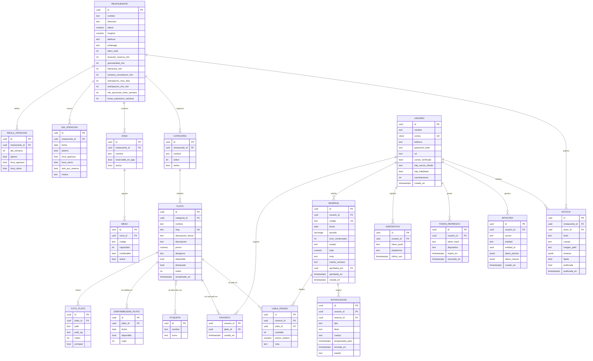
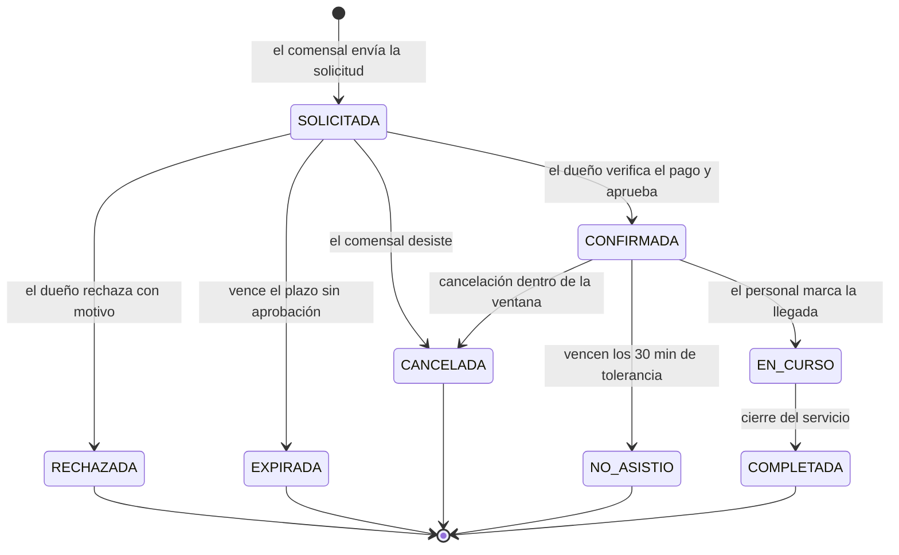
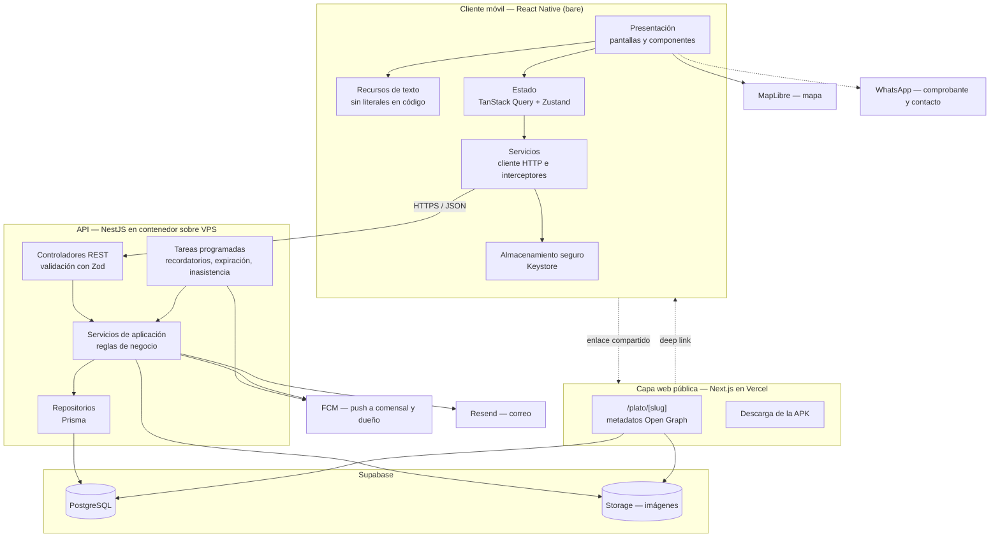
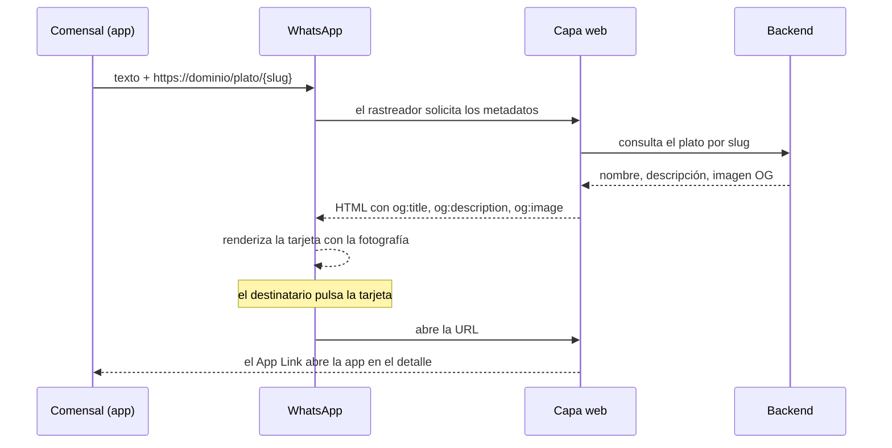
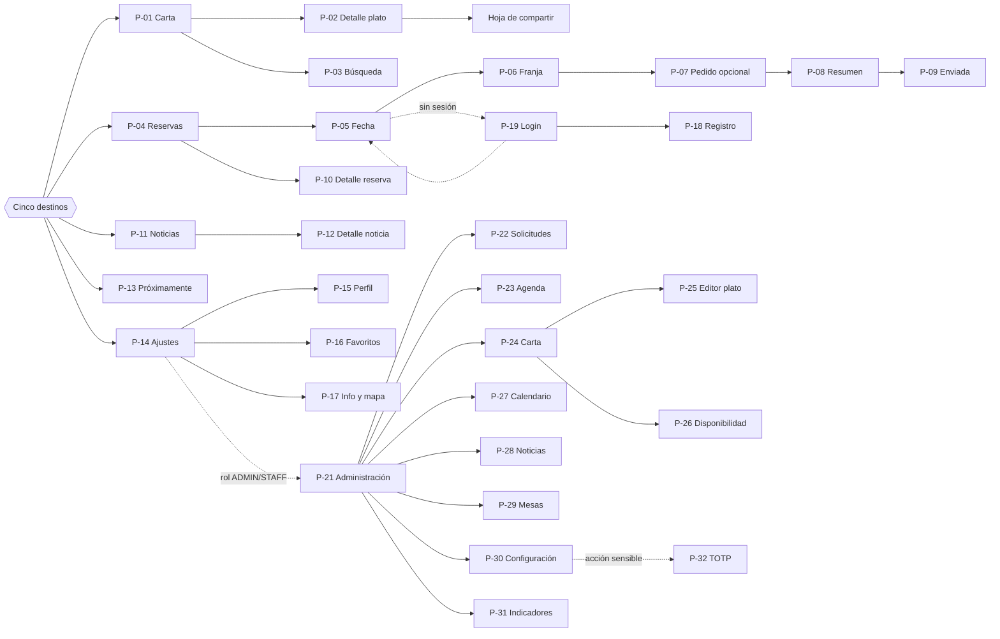

# Sprint 0 — Análisis y Diseño
### App móvil de carta digital, reservas y noticias — El Encanto Campestre
**Asignatura:** Electiva V — Desarrollo Móvil · **Periodo:** agosto – noviembre 2026
**Versión:** 0.2 · **Actualizado:** 20 de agosto de 2026

> Versión revisada tras la ronda de decisiones con el cliente. Los cambios de fondo respecto de la 0.1 están listados en §17.

---

## 1. Ficha del proyecto

| Campo | Definición |
|---|---|
| Cliente | El Encanto Campestre — Vereda Las Huacas, Timbío, Cauca. Sede única |
| Producto | Aplicación móvil propia del restaurante: carta digital, reservas con pedido opcional y muro de noticias |
| Plataforma | Android. El código se escribe portable, pero iOS queda fuera del alcance |
| Equipo | Alex Santacruz (10 h/sem) · Fabián Hoyos (8 h/sem) · Yeison Muñoz (8 h/sem) |
| Marco de trabajo | Scrum adaptado, sprints de dos semanas, tablero en Jira |
| Construcción | Generación asistida por IA con revisión y explicación obligatoria de cada módulo |
| Destino | Presentación académica y posterior trámite de venta al cliente |

---

## 2. Contexto y problemática

### 2.1 El cliente

El Encanto Campestre es un restaurante campestre en zona rural de Timbío. Su operación tiene tres rasgos que condicionan el diseño:

- **Atiende de forma discontinua.** Fines de semana y festivos como norma. Entre semana abre solo cuando una reserva de 15 personas o más lo justifica.
- **Recibe grupos grandes.** Une mesas hasta armar mesas de 40 personas, y recibe grupos empresariales que reservan con meses de antelación.
- **Tiene atractivos anexos.** Pista de motos y zona de pesca, que hoy se anuncian de forma informal y que a futuro podrían reservarse.

Además cuenta con una zona VIP llamada **Mirador**, de hasta 10 personas más 2 niños, con costo adicional de servicio.

### 2.2 Problemas que se pretenden atender

| # | Problema | Cómo lo aborda la aplicación |
|---|---|---|
| P-1 | Los días de atención cambian y el comensal no sabe si el restaurante abre | Calendario de atención publicado y muro de noticias |
| P-2 | Las reservas se coordinan por conversación, sin registro estructurado | Solicitud de reserva en la app con código, fecha, franja y número de comensales |
| P-3 | La cocina no sabe con antelación qué se va a pedir en grupos grandes | Pedido opcional adjunto a la reserva, con ticket copiable al grupo de cocina |
| P-4 | La carta circula como imagen desactualizada | Carta administrable, con disponibilidad marcada por fecha |
| P-5 | Los eventos y novedades dependen del alcance de redes sociales | Muro de noticias con notificación al comensal |
| P-6 | No hay registro de cuántas personas asistirán ni cómo adecuar el salón | Panel de solicitudes con número de comensales por reserva |

### 2.3 Qué NO resuelve la aplicación

El pago ocurre fuera del sistema: efectivo, PSE o Nequi al número del dueño, con comprobante enviado por WhatsApp. La aplicación no procesa pagos ni verifica transacciones. Esa verificación es humana y es, precisamente, el paso que convierte una solicitud en reserva confirmada.

---

## 3. Objetivos

### 3.1 General

Desarrollar una aplicación móvil que permita a los comensales de El Encanto Campestre consultar la carta vigente, solicitar reservas con pedido anticipado opcional y seguir las novedades del restaurante, y a sus dueños administrar carta, calendario, solicitudes y publicaciones desde el mismo producto.

### 3.2 Específicos

1. Especificar requisitos mediante historias de usuario con criterios de aceptación comprobables.
2. Diseñar un modelo relacional que represente el dominio, incluida la disponibilidad de platos por fecha y el calendario de atención discontinuo.
3. Implementar una arquitectura por capas con separación entre cliente móvil, servicios de aplicación y persistencia.
4. Construir un módulo de reservas que valide aforo por franja y sostenga un ciclo de aprobación manual.
5. Habilitar la difusión de platos hacia WhatsApp con previsualización de imagen mediante una capa web con metadatos Open Graph.
6. Incorporar notificaciones al comensal y al dueño, incluso con la aplicación cerrada.
7. Externalizar la totalidad de los textos de interfaz, sin valores fijos en el código.
8. Documentar cada decisión técnica de forma que el equipo pueda explicarla en las evaluaciones parciales.

---

## 4. Actores

| Actor | Descripción | Autenticación |
|---|---|---|
| **Visitante** | Explora carta, noticias e información sin sesión | No requerida |
| **Comensal** | Usuario registrado. Solicita reservas, adjunta pedido, marca favoritos, recibe notificaciones | Correo y contraseña |
| **Dueño (administrador)** | Puede haber varias cuentas con este rol. Aprueba o rechaza solicitudes, gestiona carta, calendario, noticias y configuración | Correo y contraseña, más TOTP en acciones sensibles |
| **Personal (staff)** | Consulta la agenda del día y marca llegadas. Sin acceso a configuración | Correo y contraseña |
| **Procesos programados** | Recordatorios, expiración de solicitudes sin comprobante, marcado de inasistencia | Credencial de servicio |

---

## 5. Alcance

### 5.1 Dentro del alcance

- Carta con categorías, detalle de plato con galería de hasta 10 fotos, búsqueda y filtros.
- Disponibilidad de platos marcada por fecha, no solo de forma global.
- Registro, inicio de sesión y recuperación de contraseña.
- Solicitud de reserva: fecha, franja, número de comensales y pedido opcional con ticket y total.
- Aprobación o rechazo manual por parte del dueño, con notificación al comensal.
- Muro de noticias con imagen, texto y enlaces.
- Pantalla "Próximamente" con tarjetas informativas de pista de motos y zona de pesca.
- Panel de administración embebido: carta, disponibilidad por fecha, calendario de atención, mesas y zonas, solicitudes, agenda del día, noticias y configuración.
- Compartir platos hacia WhatsApp con vista previa de imagen.
- Notificaciones push y por correo, al comensal y al dueño.
- Ubicación sobre mapa y contacto directo por WhatsApp.
- Favoritos.

### 5.2 Fuera del alcance

Pagos en línea · pedidos a domicilio · facturación e integración con POS · inventario · fidelización · múltiples sedes en la interfaz · reserva efectiva de pista de motos y zona de pesca · reserva de la zona Mirador desde la app (se coordina por WhatsApp) · iOS · chat dentro de la aplicación.

---

## 6. Requisitos funcionales

Prioridad MoSCoW: **M** imprescindible · **S** deseable · **C** opcional.

### 6.1 Autenticación y cuenta (AUT)

| ID | Requisito | Prio. |
|---|---|---|
| RF-AUT01 | Registrar cuenta con nombre, correo, teléfono y contraseña | M |
| RF-AUT02 | Verificar el correo mediante código | S |
| RF-AUT03 | Autenticar y emitir token de acceso corto más token de refresco rotatorio | M |
| RF-AUT04 | Cerrar sesión e invalidar el token de refresco del dispositivo | M |
| RF-AUT05 | Restablecer contraseña mediante código enviado al correo | S |
| RF-AUT06 | Habilitar segundo factor TOTP sobre cuentas con rol de dueño | S |
| RF-AUT07 | Exigir TOTP antes de acciones sensibles | S |
| RF-AUT08 | Permitir navegar carta y noticias sin sesión, solicitando autenticación solo al reservar | M |
| RF-AUT09 | Avisar con un diálogo antes de que expire la sesión, si la aplicación está en uso | S |

### 6.2 Carta (MEN)

| ID | Requisito | Prio. |
|---|---|---|
| RF-MEN01 | Presentar platos agrupados por categoría con foto, nombre, descripción breve y precio | M |
| RF-MEN02 | Mostrar en la pantalla de inicio los platos disponibles para el próximo día de atención | M |
| RF-MEN03 | Abrir el detalle con galería de hasta 10 fotos, descripción extendida, etiquetas y alérgenos | M |
| RF-MEN04 | Buscar platos por nombre e ingrediente declarado | M |
| RF-MEN05 | Filtrar por categoría, etiqueta dietaria y rango de precio | S |
| RF-MEN06 | Distinguir visualmente los platos no disponibles para la fecha consultada | M |
| RF-MEN07 | Marcar y consultar favoritos | S |
| RF-MEN08 | Conservar la última carta consultada para lectura sin conexión | S |

### 6.3 Reservas (RES)

| ID | Requisito | Prio. |
|---|---|---|
| RF-RES01 | Seleccionar fecha entre los días marcados como abiertos en el calendario | M |
| RF-RES02 | Ofrecer únicamente franjas dentro del horario configurado y con aforo disponible | M |
| RF-RES03 | Indicar el número de comensales, hasta el aforo máximo configurado | M |
| RF-RES04 | Permitir adjuntar un pedido opcional, mostrando solo los platos disponibles para esa fecha | M |
| RF-RES05 | Calcular y presentar el total del pedido, sin impuestos | M |
| RF-RES06 | Registrar la solicitud en estado `SOLICITADA` y generar un código legible | M |
| RF-RES07 | Presentar las instrucciones de pago y una acción para enviar el comprobante por WhatsApp | M |
| RF-RES08 | Notificar al dueño la llegada de una solicitud, por push y por correo, con la aplicación cerrada | M |
| RF-RES09 | Permitir al dueño aprobar o rechazar la solicitud, con motivo en el rechazo | M |
| RF-RES10 | Notificar al comensal la aprobación o el rechazo | M |
| RF-RES11 | Consultar el historial de reservas del comensal | M |
| RF-RES12 | Cancelar hasta una hora antes de la reserva | M |
| RF-RES13 | Expirar automáticamente las solicitudes sin aprobar transcurrido el plazo configurado | S |
| RF-RES14 | Marcar inasistencia transcurridos 30 minutos de tolerancia | S |
| RF-RES15 | Adicionar platos a una reserva aprobada, calculando el excedente a pagar | S |
| RF-RES16 | Permitir cambios de plato por otro de igual o mayor precio, sin reembolso | C |
| RF-RES17 | Impedir reservar en fechas cerradas y advertir que entre semana se requieren 15 personas o más | M |
| RF-RES18 | Generar un ticket de la reserva en formato copiable como texto | M |

### 6.4 Noticias (NOT)

| ID | Requisito | Prio. |
|---|---|---|
| RF-NOT01 | Presentar las publicaciones en orden cronológico inverso | M |
| RF-NOT02 | Abrir el detalle con imagen, texto completo y enlaces externos | M |
| RF-NOT03 | Permitir al dueño crear, editar, publicar y despublicar noticias | M |
| RF-NOT04 | Permitir fijar una publicación en la parte superior del muro | S |
| RF-NOT05 | Notificar a los usuarios que lo hayan consentido cuando se publica una noticia | S |
| RF-NOT06 | Compartir una noticia hacia aplicaciones externas | C |

### 6.5 Administración (ADM)

| ID | Requisito | Prio. |
|---|---|---|
| RF-ADM01 | Crear, editar, desactivar y reordenar categorías | M |
| RF-ADM02 | Crear y editar platos con galería de hasta 10 fotos | M |
| RF-ADM03 | Marcar la disponibilidad de un plato para fechas concretas | M |
| RF-ADM04 | Alternar la disponibilidad general de un plato de forma inmediata | M |
| RF-ADM05 | Definir zonas y mesas con su capacidad, para calcular el aforo | M |
| RF-ADM06 | Configurar el calendario de atención del año, con horarios por día | M |
| RF-ADM07 | Configurar los parámetros de reserva: duración, granularidad, tolerancia, ventana de cancelación y anticipación | M |
| RF-ADM08 | Consultar la bandeja de solicitudes pendientes de aprobación | M |
| RF-ADM09 | Consultar la agenda del día ordenada por hora | M |
| RF-ADM10 | Registrar llegada, inasistencia o cancelación sobre una reserva | M |
| RF-ADM11 | Mostrar, junto a cada solicitud, el número de cancelaciones previas de ese usuario | S |
| RF-ADM12 | Copiar el ticket de una reserva para pegarlo en el grupo de cocina | M |
| RF-ADM13 | Consultar indicadores agregados de reservas, comensales e inasistencias | C |
| RF-ADM14 | Registrar en bitácora las acciones administrativas | S |

### 6.6 Información y difusión (INF)

| ID | Requisito | Prio. |
|---|---|---|
| RF-INF01 | Presentar ubicación sobre mapa, dirección, teléfono y calendario de atención | M |
| RF-INF02 | Abrir la navegación hacia el restaurante en la aplicación de mapas del dispositivo | S |
| RF-INF03 | Ofrecer contacto directo por WhatsApp | M |
| RF-INF04 | Compartir un plato mediante enlace público con vista previa de imagen en WhatsApp | M |
| RF-INF05 | Abrir la aplicación en el detalle del plato al pulsar un enlace compartido | S |
| RF-INF06 | Presentar la pantalla "Próximamente" con tarjetas de pista de motos y zona de pesca | S |
| RF-INF07 | Registrar el dispositivo para notificaciones push | M |
| RF-INF08 | Administrar preferencias de notificación por tipo | S |

---

## 7. Requisitos no funcionales

| ID | Categoría | Requisito | Verificación |
|---|---|---|---|
| RNF-01 | Rendimiento | La carta se presenta en menos de 2 s con red estable y se desplaza con fluidez con 100 platos | Medición en dispositivo de gama media |
| RNF-02 | Rendimiento | Lecturas de la API por debajo de 400 ms en el percentil 95 | Registro de latencia |
| RNF-03 | Mantenibilidad | **Ningún texto de interfaz está escrito en el código.** Todo proviene de archivos de recursos | Búsqueda de literales en revisión |
| RNF-04 | Mantenibilidad | Los parámetros de negocio (§B del documento de decisiones) son configuración, no constantes | Inspección del esquema |
| RNF-05 | Seguridad | Contraseñas con Argon2id | Revisión de código |
| RNF-06 | Seguridad | Token de refresco en el almacenamiento seguro del sistema operativo | Revisión de código |
| RNF-07 | Seguridad | Comunicación sobre HTTPS | Configuración de red |
| RNF-08 | Seguridad | RLS habilitado con negación por defecto en todas las tablas | Inspección de políticas |
| RNF-09 | Usabilidad | Los flujos principales se completan en un máximo de cinco interacciones | Prueba de recorrido |
| RNF-10 | Accesibilidad | Contraste WCAG AA y etiquetas de accesibilidad en controles | Auditoría manual |
| RNF-11 | Compatibilidad | Android 8.0 (API 26) o superior, orientación vertical | Pruebas en emulador y dispositivo |
| RNF-12 | Portabilidad | El backend se ejecuta en contenedor, de modo que local y VPS se comporten igual | Ejecución en ambos entornos |
| RNF-13 | Privacidad | Tratamiento conforme a la Ley 1581 de 2012, con política aceptada en el registro | Revisión documental |
| RNF-14 | Observabilidad | Registro estructurado en el backend y reporte de fallos en el cliente | Inspección de logs |
| RNF-15 | Confiabilidad | Copia de seguridad mensual de la base de datos | Registro de respaldos |

---

## 8. Historias de usuario

Selección representativa. El conjunto completo vive en Jira.

### HU-01 — Ver qué hay disponible para el próximo día de atención

> **Como** comensal, **quiero** ver los platos que estarán disponibles el día que pienso visitar, **para** decidir si vale la pena ir.

- **Dado** que abro la aplicación, **cuando** carga la pantalla de inicio, **entonces** veo el próximo día de atención y los platos habilitados para esa fecha.
- **Dado** que un plato no está habilitado para la fecha consultada, **cuando** aparece en la carta, **entonces** se presenta atenuado con la etiqueta correspondiente.
- **Dado** que no tengo conexión, **cuando** abro la carta, **entonces** veo la última versión guardada con un aviso de posible desactualización.

**Estimación:** 8 puntos · **Sprint:** 2

---

### HU-02 — Solicitar una reserva con pedido opcional

> **Como** comensal, **quiero** separar mesa para una fecha y, si quiero, dejar listo el pedido, **para** asegurar el lugar y agilizar la cocina.

- **Dado** que no he iniciado sesión, **cuando** pulso "Reservar", **entonces** el sistema me lleva al inicio de sesión y regresa al flujo conservando lo seleccionado.
- **Dado** que selecciono una fecha, **cuando** el calendario indica que ese día está cerrado, **entonces** el sistema lo señala y explica que entre semana se abre desde 15 personas.
- **Dado** que elijo fecha y franja, **cuando** avanzo, **entonces** puedo adjuntar un pedido eligiendo entre los platos disponibles para esa fecha, o continuar sin pedido.
- **Dado** que adjunto un pedido, **cuando** reviso el resumen, **entonces** veo el detalle por plato y el total sin impuestos.
- **Dado** que confirmo, **cuando** la solicitud se registra, **entonces** obtengo un código, veo las instrucciones de pago y una acción para enviar el comprobante por WhatsApp.
- **Dado** que la solicitud queda registrada, **cuando** el proceso termina, **entonces** el dueño recibe notificación push y correo aunque no tenga la aplicación abierta.

**Estimación:** 13 puntos · **Sprint:** 3

---

### HU-03 — Aprobar o rechazar una solicitud

> **Como** dueño, **quiero** revisar las solicitudes y aprobarlas tras verificar el pago, **para** confirmar solo lo que está en firme.

- **Dado** que hay solicitudes pendientes, **cuando** abro la bandeja, **entonces** las veo ordenadas por fecha de reserva, con comensales, pedido, total y cancelaciones previas del usuario.
- **Dado** que verifico el pago, **cuando** apruebo, **entonces** la reserva pasa a `CONFIRMADA` y el comensal recibe notificación.
- **Dado** que rechazo, **cuando** indico el motivo, **entonces** la reserva pasa a `RECHAZADA` y el comensal recibe la notificación con ese motivo.
- **Dado** que una reserva tiene pedido, **cuando** pulso "Copiar ticket", **entonces** el detalle queda en el portapapeles con formato legible para pegarlo en el grupo de cocina.

**Estimación:** 8 puntos · **Sprint:** 3

---

### HU-04 — Publicar una noticia

> **Como** dueño, **quiero** publicar novedades con imagen y enlaces, **para** anunciar días de atención y eventos.

- **Dado** que tengo rol de dueño, **cuando** creo una publicación, **entonces** puedo cargar una imagen, escribir el texto y agregar enlaces.
- **Dado** que publico, **cuando** el comensal abre el muro, **entonces** ve la publicación en primer lugar por orden cronológico.
- **Dado** que fijo una publicación, **cuando** se listan las noticias, **entonces** aparece arriba con distintivo, sin importar su fecha.

**Estimación:** 8 puntos · **Sprint:** 4

---

### HU-05 — Configurar el calendario de atención

> **Como** dueño, **quiero** marcar en qué días abre el restaurante, **para** que las reservas solo se ofrezcan en fechas válidas.

- **Dado** que abro el calendario, **cuando** lo consulto, **entonces** veo el año con los días de atención resaltados según la regla base y las excepciones.
- **Dado** que habilito un día entre semana, **cuando** lo guardo, **entonces** ese día queda disponible para reservar.
- **Dado** que cierro una fecha con reservas confirmadas, **cuando** lo intento, **entonces** el sistema advierte cuántas reservas se verían afectadas antes de continuar.

**Estimación:** 8 puntos · **Sprint:** 3

---

### HU-06 — Compartir un plato por WhatsApp con vista previa

> **Como** comensal, **quiero** compartir un plato y que se vea la fotografía, **para** recomendarlo.

- **Dado** que estoy en el detalle, **cuando** pulso "Compartir", **entonces** se abre la hoja del sistema con el nombre del plato y un enlace público.
- **Dado** que envío el enlace por WhatsApp, **cuando** el destinatario lo recibe, **entonces** ve una tarjeta con fotografía, nombre y descripción.
- **Dado** que el destinatario tiene la aplicación instalada, **cuando** pulsa la tarjeta, **entonces** se abre en el detalle de ese plato.

**Estimación:** 8 puntos · **Sprint:** 4

---

## 9. Modelo de datos

### 9.1 Diagrama entidad-relación



### 9.2 Enumeraciones

| Enumeración | Valores |
|---|---|
| `rol_usuario` | `COMENSAL`, `STAFF`, `ADMIN` |
| `estado_reserva` | `SOLICITADA`, `CONFIRMADA`, `RECHAZADA`, `EXPIRADA`, `EN_CURSO`, `COMPLETADA`, `CANCELADA`, `NO_ASISTIO` |
| `tipo_notificacion` | `SOLICITUD_NUEVA`, `APROBACION`, `RECHAZO`, `RECORDATORIO`, `CANCELACION`, `NOTICIA` |
| `plataforma_dispositivo` | `ANDROID`, `IOS` |

### 9.3 Reglas de integridad

1. **Precedencia del calendario.** `DIA_ATENCION` prevalece sobre `REGLA_ATENCION` para una fecha concreta. El algoritmo consulta primero la excepción; si no existe, aplica la regla del día de la semana. Es lo que permite representar "abrimos fines de semana, salvo este miércoles que hay grupo empresarial".

2. **Disponibilidad de plato por fecha.** `DISPONIBILIDAD_PLATO` prevalece sobre `PLATO.disponible`. Sin registro para la fecha, aplica la disponibilidad general. Índice único sobre `(plato_id, fecha)`.

3. **Aforo por franja.** El restaurante no asigna mesas concretas desde la aplicación: la reserva garantiza lugar y el salón se adecúa después. Por tanto la validación es de aforo, no de solapamiento:

   ```sql
   -- dentro de una transacción SERIALIZABLE, o con bloqueo explícito
   SELECT COALESCE(SUM(num_comensales), 0) AS ocupado
     FROM reserva
    WHERE fecha = $1
      AND periodo && $2
      AND estado IN ('SOLICITADA', 'CONFIRMADA', 'EN_CURSO');
   -- se acepta si ocupado + solicitados <= aforo_total
   ```

   La lectura y la inserción deben ocurrir en la misma transacción con nivel de aislamiento serializable; de lo contrario dos solicitudes concurrentes pueden superar el aforo. Este es el punto de concurrencia del proyecto y conviene poder explicarlo.

4. **Total coherente.** `RESERVA.total` es la suma de `cantidad × precio_unitario` de sus líneas. El precio se copia en la línea al momento de solicitar, para que un cambio posterior de carta no altere reservas ya emitidas.

5. **Máximo de fotos.** Hasta 10 filas de `FOTO_PLATO` por plato, con exactamente una marcada como principal.

6. **Aforo mínimo entre semana.** Si la fecha no está abierta por regla ni por excepción, solo se admite la solicitud cuando `num_comensales >= min_personas_entre_semana`.

7. **Borrado lógico.** Platos, categorías y noticias se desactivan, no se eliminan, para preservar favoritos, líneas de pedido y bitácora.

8. **Índices frecuentes:** `RESERVA(fecha, estado)`, `RESERVA(usuario_id, creada_en DESC)`, `DISPONIBILIDAD_PLATO(fecha)`, `PLATO(categoria_id, orden)`, `NOTICIA(fijada DESC, publicada_en DESC)`.

### 9.4 Ciclo de vida de la reserva



> La diferencia con un sistema de reservas convencional está en que `SOLICITADA` es el estado inicial de **toda** reserva y su salida depende de una verificación humana externa al sistema. Es un buen ejemplo para explicar por qué las transiciones se validan en el servicio de dominio y no en el controlador.

---

## 10. Arquitectura

### 10.1 Vista de componentes



### 10.2 Organización interna

**Backend.** Un módulo por dominio, tres capas dentro de cada uno:

```
src/
  modules/
    auth/          usuarios/      menu/
    reservas/      noticias/      restaurante/
    notificaciones/               compartir/
  common/    guards/ interceptors/ filters/ decorators/
  infra/     prisma/ storage/ push/ mailer/
  jobs/
```

**Cliente.** Organización por características, de modo que cada carpeta se corresponda con un módulo de §6:

```
src/
  app/          navegación, providers, tema
  features/     auth/ menu/ reservas/ noticias/ proximamente/ admin/ ajustes/
  shared/       api/ components/ hooks/ utils/ i18n/
  assets/
```

### 10.3 Flujo de compartir con vista previa



**Restricciones que conviene fijar desde ahora.** WhatsApp descarta imágenes por encima de ~600 KB y no muestra vista previa por debajo de 100×100 px; la variante recomendada es 1200×630 px en JPG, PNG o WebP. Por eso `FOTO_PLATO` guarda `path` y `path_og` por separado, generados con `sharp` al momento de la carga. WhatsApp además cachea las vistas previas durante días, así que la URL de la imagen debe versionarse con un fragmento derivado de `actualizado_en`. La apertura en la aplicación requiere `assetlinks.json` publicado en el dominio, con las huellas SHA-256 de los certificados de depuración y de publicación.

---

## 11. Stack tecnológico

Versiones consultadas el 20 de agosto de 2026. Conviene fijarlas y no actualizarlas durante el semestre salvo por corrección de seguridad.

### 11.1 Cliente

| Pieza | Elección | Versión |
|---|---|---|
| Framework | React Native, CLI de comunidad, sin framework | 0.87.0 |
| Runtime de UI | React | 19.2.x |
| Arquitectura de render | Nueva Arquitectura (Fabric + TurboModules), Hermes | por defecto |
| Lenguaje | TypeScript | 5.x |
| Navegación | React Navigation | 7.3.x |
| Estado de servidor | TanStack Query | 5.x |
| Estado de interfaz | Zustand | 5.x |
| Formularios | React Hook Form + Zod | — |
| HTTP | Axios con interceptores | 1.x |
| Textos | i18next + react-i18next | — |
| Almacenamiento seguro | react-native-keychain | — |
| Caché local | react-native-mmkv | — |
| Imágenes | react-native-fast-image | — |
| Notificaciones | @react-native-firebase/messaging + @notifee/react-native | 26.3.x / 9.1.x |
| Mapas | @maplibre/maplibre-react-native | — |
| Animación | reanimated + gesture-handler | — |

Sin biblioteca de componentes de terceros: se construye un sistema propio reducido sobre `StyleSheet`. Más trabajo inicial de interfaz, pero código que el equipo escribió y puede explicar.

### 11.2 Backend

| Pieza | Elección | Versión |
|---|---|---|
| Framework | NestJS | 11.2.x |
| Runtime | Node.js LTS | 22.x |
| Empaquetado | Docker desde el primer día | — |
| ORM | Prisma | 6.x |
| Validación | Zod, compartido con el cliente vía `packages/shared` | — |
| Autenticación | Passport JWT + Argon2 | — |
| Segundo factor | otplib + qrcode | — |
| Imágenes | sharp | — |
| Tareas programadas | @nestjs/schedule | — |
| Correo | Resend | — |
| Documentación | @nestjs/swagger | — |
| Pruebas | Jest + Supertest | — |

### 11.3 Datos, web e infraestructura

| Pieza | Elección |
|---|---|
| Base de datos | PostgreSQL gestionado por Supabase, accedido solo desde el backend |
| Archivos | Supabase Storage |
| Identificadores | UUID v7 si la versión de PostgreSQL lo admite |
| Despliegue del backend | VPS con contenedor |
| Capa web | Next.js en Vercel: `/plato/[slug]`, `/noticia/[id]`, descarga de APK y archivos de verificación de deep links |
| Distribución | Firebase App Distribution, con APK en la web como alternativa |
| Errores | Sentry desde Sprint 2 |
| Repositorio | Monorepo `apps/mobile`, `apps/api`, `apps/web`, `packages/shared` |
| Tablero | Jira · Código en GitHub |

---

## 12. Servicios externos

| Servicio | Uso | Costo | Observación |
|---|---|---|---|
| Supabase | PostgreSQL y Storage | Gratuito | Se suspende por inactividad prolongada; conviene un acceso periódico |
| VPS | Backend en contenedor | Según proveedor | Único componente con costo fijo |
| Vercel | Capa web | Gratuito | Suficiente para el volumen previsto |
| Firebase Cloud Messaging | Push a comensal y a dueño | Gratuito | Requiere `google-services.json` |
| Resend | Verificación, recuperación y aviso de solicitud al dueño | Gratuito con límite diario | — |
| MapLibre | Mapa | Gratuito | Sin cuenta de facturación |
| WhatsApp | Comprobante, coordinación de la zona Mirador y difusión | Gratuito | Esquema `https://wa.me/<número>`; sin API de negocios |
| Sentry | Reporte de fallos | Gratuito | Opcional |

---

## 13. Navegación y pantallas

### 13.1 Navegación principal

Cinco destinos inferiores, con Noticias en el botón central:

```
[ Carta ]   [ Reservas ]   ( Noticias )   [ Próximamente ]   [ Ajustes ]
```

El acceso a Administración vive dentro de Ajustes y solo aparece con rol `ADMIN` o `STAFF`.

### 13.2 Inventario de pantallas

| # | Pantalla | Acceso | Requisitos |
|---|---|---|---|
| P-01 | Carta / inicio | Pública | RF-MEN01, RF-MEN02, RF-MEN06 |
| P-02 | Detalle de plato | Pública | RF-MEN03, RF-MEN07, RF-INF04 |
| P-03 | Búsqueda y filtros | Pública | RF-MEN04, RF-MEN05 |
| P-04 | Mis reservas | Autenticada | RF-RES11 |
| P-05 | Reservar · fecha y comensales | Autenticada | RF-RES01, RF-RES03, RF-RES17 |
| P-06 | Reservar · franja | Autenticada | RF-RES02 |
| P-07 | Reservar · pedido opcional | Autenticada | RF-RES04, RF-RES05 |
| P-08 | Reservar · resumen | Autenticada | RF-RES06 |
| P-09 | Solicitud enviada e instrucciones de pago | Autenticada | RF-RES07 |
| P-10 | Detalle de reserva | Autenticada | RF-RES12, RF-RES15 |
| P-11 | Noticias | Pública | RF-NOT01, RF-NOT04 |
| P-12 | Detalle de noticia | Pública | RF-NOT02, RF-NOT06 |
| P-13 | Próximamente | Pública | RF-INF06 |
| P-14 | Ajustes | Pública | — |
| P-15 | Perfil y preferencias de notificación | Autenticada | RF-AUT04, RF-INF08 |
| P-16 | Favoritos | Autenticada | RF-MEN07 |
| P-17 | Información y mapa | Pública | RF-INF01, RF-INF02, RF-INF03 |
| P-18 | Registro | Pública | RF-AUT01 |
| P-19 | Inicio de sesión | Pública | RF-AUT03 |
| P-20 | Recuperar contraseña | Pública | RF-AUT05 |
| P-21 | Admin · inicio | ADMIN/STAFF | — |
| P-22 | Admin · solicitudes | ADMIN | RF-ADM08, RF-ADM11, RF-ADM12 |
| P-23 | Admin · agenda del día | ADMIN/STAFF | RF-ADM09, RF-ADM10 |
| P-24 | Admin · carta | ADMIN | RF-ADM01, RF-ADM04 |
| P-25 | Admin · editor de plato | ADMIN | RF-ADM02 |
| P-26 | Admin · disponibilidad por fecha | ADMIN | RF-ADM03 |
| P-27 | Admin · calendario de atención | ADMIN | RF-ADM06 |
| P-28 | Admin · noticias | ADMIN | RF-NOT03, RF-NOT04 |
| P-29 | Admin · mesas y zonas | ADMIN | RF-ADM05 |
| P-30 | Admin · configuración | ADMIN | RF-ADM07 |
| P-31 | Admin · indicadores | ADMIN | RF-ADM13 |
| P-32 | Verificación TOTP | ADMIN | RF-AUT06, RF-AUT07 |

### 13.3 Mapa de navegación



> La especificación pantalla por pantalla —objetivo, datos, estructura, estados y prompts de trabajo— está en `Brief_Diseno_Wireframes.md`. Los resultados se archivan en `design/`.

---

## 14. Decisiones de arquitectura (ADR)

### ADR-001 — La reserva se registra en la app; el pago y su verificación ocurren fuera
**Estado:** aceptada (revisada) · 20/08/2026

El cliente cobra por efectivo, PSE o Nequi, y en ocasiones fía a conocidos. Integrar una pasarela no reflejaría su operación real.

**Decisión.** La app registra la solicitud con su detalle y su total, y presenta las instrucciones de pago con una acción para enviar el comprobante por WhatsApp. La aprobación es manual.

**Consecuencias.** `SOLICITADA` deja de ser un estado excepcional y pasa a ser el inicial de toda reserva. Aparece el rechazo con motivo y la expiración por falta de aprobación. WhatsApp vuelve al flujo operativo, aunque no gestiona la reserva.

---

### ADR-002 — React Native con CLI de comunidad, sin framework
**Estado:** aceptada · 20/08/2026

Inicialización con `@react-native-community/cli` sobre React Native 0.87 con la Nueva Arquitectura activa. Los directorios `android/` e `ios/` quedan bajo control directo, lo que permite explicar la configuración nativa —permisos, App Links, servicios de Firebase— en los parciales.

**Consecuencias.** El equipo asume la configuración del entorno y las actualizaciones de versión. Conviene documentar el procedimiento en el repositorio durante el Sprint 1.

---

### ADR-003 — Backend propio en NestJS sobre Supabase
**Estado:** aceptada · 20/08/2026

Se interpone una API en NestJS; Supabase queda como PostgreSQL gestionado y almacenamiento. Reglas como la aprobación manual, la disponibilidad por fecha o el aforo por franja son difíciles de expresar solo con políticas de fila, y un backend explícito hace visible la separación de capas.

**Consecuencias.** Un componente más que desplegar. Se resuelve con contenedor sobre VPS (ADR-008).

---

### ADR-004 — Capa web mínima en Next.js para la vista previa en WhatsApp
**Estado:** aceptada · 20/08/2026

WhatsApp construye la vista previa leyendo etiquetas Open Graph del HTML de una URL, y una app móvil no expone HTML. Se publica una capa web con renderizado en servidor para `/plato/[slug]` y `/noticia/[id]`, más los archivos de verificación de deep links.

**Consecuencias.** Un tercer proyecto en el monorepo. Se aprovecha para alojar la APK, lo que da una vía de distribución alterna sin la tienda.

---

### ADR-005 — Control de aforo por franja, no asignación de mesa
**Estado:** aceptada (sustituye la versión anterior) · 20/08/2026

**Contexto.** La versión 0.1 proponía asignar mesas concretas y sostener el no solapamiento con una restricción `EXCLUDE USING gist`. La conversación con el cliente mostró que el restaurante rara vez se llena, une mesas con libertad hasta armar mesas de 40 personas y adecúa el salón después de conocer las reservas. Asignar mesas desde la app resolvería un problema que el cliente no tiene.

**Decisión.** La reserva compromete aforo, no mesas. La validación compara la suma de comensales de las reservas activas de la franja contra el aforo total, dentro de una transacción serializable. `ZONA` y `MESA` se conservan como configuración, para calcular el aforo y para que el dueño organice el salón.

**Consecuencias.** El módulo de reservas se simplifica de forma apreciable y el Sprint 3 deja de ser el cuello de botella del cronograma. El punto de concurrencia se desplaza del motor de la base de datos al nivel de aislamiento de la transacción, que sigue siendo material explicable: conviene poder argumentar por qué una lectura seguida de una escritura, sin aislamiento adecuado, permite superar el aforo.

---

### ADR-006 — Aplicación única con vistas condicionadas por rol
**Estado:** aceptada · 20/08/2026

Una sola base de código; el árbol de administración se monta según el rol devuelto por el backend.

**Consecuencias.** El paquete incluye código de administración para todos los usuarios. La protección efectiva reside en el servidor mediante `RolesGuard`; la condición en el cliente es de experiencia de usuario, no de seguridad. Conviene enunciar esa distinción en la sustentación.

---

### ADR-007 — Segundo factor TOTP en lugar de OTP por SMS
**Estado:** aceptada · 20/08/2026

TOTP (RFC 6238) con `otplib` sobre las cuentas de dueño, para acciones sensibles: cambio de rol, modificación del calendario, eliminación definitiva y cancelación masiva. Sin costo por mensaje, sin proveedor externo y reproducible en la sustentación.

**Consecuencias.** El secreto TOTP se cifra en reposo y se define un mecanismo de recuperación con códigos de respaldo de un solo uso.

---

### ADR-008 — Backend contenedorizado sobre VPS
**Estado:** aceptada · 20/08/2026

Se descarta el despliegue en plataformas gestionadas y se opta por VPS con contenedor desde el primer día, de modo que el entorno local y el de producción se comporten igual. Elimina las sorpresas de despliegue a mitad de semestre y permite ejecutar tareas programadas sin las restricciones de los niveles gratuitos.

**Consecuencias.** El equipo asume la configuración del servidor. Conviene resolverla en el Sprint 1, no en el Sprint 5.

---

### ADR-009 — Textos externalizados desde el primer commit
**Estado:** aceptada · 20/08/2026

Ningún texto de interfaz se escribe en el código: todo proviene de archivos de recursos, incluidos títulos y mensajes de error.

**Justificación.** Nace de una condición del cliente y habilita un cambio de idioma futuro sin tocar componentes. Introducirlo después implica recorrer toda la interfaz.

**Consecuencias.** Se adopta `i18next` en el Sprint 1. La revisión de código debe rechazar literales. Es también un criterio verificable para RNF-03.

---

### ADR-010 — Disponibilidad de platos por fecha
**Estado:** aceptada · 20/08/2026

El restaurante habilita platos especiales según el día. Se introduce `DISPONIBILIDAD_PLATO(plato_id, fecha)`, que prevalece sobre la disponibilidad general del plato.

**Consecuencias.** La carta deja de ser una lista estática y pasa a depender de la fecha consultada. El paso de pedido de la reserva debe filtrar por la fecha elegida, no por la del día actual: es un error fácil de cometer y conviene cubrirlo con una prueba.

---

## 15. Seguridad

| Ámbito | Medida |
|---|---|
| Contraseñas | Argon2id con parámetros de costo documentados |
| Sesión | JWT de ~15 min más refresco rotatorio con revocación por dispositivo |
| Almacenamiento en el dispositivo | Token de refresco en Keystore, nunca en almacenamiento plano |
| Autorización | `RolesGuard` en el servidor sobre cada endpoint |
| Acciones sensibles | `TotpGuard` adicional sobre calendario, roles y eliminaciones |
| Transporte | HTTPS de extremo a extremo; tráfico en claro deshabilitado en Android |
| Base de datos | RLS con negación por defecto; credencial de servicio solo en el backend |
| Carga de archivos | Validación de tipo y tamaño, renombrado y recompresión antes de almacenar |
| Límite de solicitudes | Limitación de tasa en autenticación y en creación de reservas |
| Secretos | Variables de entorno fuera del control de versiones, con `.env.example` documentado |
| Datos personales | Recolección mínima, política aceptada en el registro y eliminación de cuenta |
| Bitácora | Acciones administrativas con autor, entidad y valores previos y nuevos |

---

## 16. Definición de Listo y de Hecho

**Listo** — una historia puede entrar a un sprint cuando tiene identificador, criterios de aceptación redactados, estimación, dependencias identificadas y referencia visual si implica interfaz.

**Hecho** — una historia termina cuando el código está integrado en `develop`, pasa lint y las pruebas existentes, los criterios de aceptación se verificaron en dispositivo, la documentación está actualizada, **no introduce literales de texto en el código** y **cada integrante puede explicar qué hace, por qué se eligió ese enfoque y qué alternativa se descartó**.

Este último punto es el que sostiene la preparación para los parciales y conviene tratarlo como bloqueante, dado que la construcción se apoya en generación asistida.

---

## 17. Qué cambió respecto de la versión 0.1

| # | Cambio | Impacto |
|---|---|---|
| 1 | La reserva admite pedido opcional con ticket y total | Entidades `LINEA_PEDIDO`; cuarto paso en el flujo; requisitos RF-RES04, RF-RES05, RF-RES18 |
| 2 | La confirmación es manual y depende de un pago externo | `SOLICITADA` como estado inicial; se añaden `RECHAZADA` y `EXPIRADA`; notificación al dueño |
| 3 | La disponibilidad de platos es por fecha | Entidad `DISPONIBILIDAD_PLATO`; ADR-010 |
| 4 | Calendario de atención discontinuo | Entidades `REGLA_ATENCION` y `DIA_ATENCION`; regla de 15 personas entre semana |
| 5 | Aforo por franja en lugar de asignación de mesa | ADR-005 sustituido; el Sprint 3 se aligera |
| 6 | Módulo de noticias | Requisitos RF-NOT01 a RF-NOT06; entidad `NOTICIA` |
| 7 | Pantalla "Próximamente" | RF-INF06 |
| 8 | Navegación de cinco destinos | §13.1; el inventario de pantallas se reorganiza |
| 9 | Textos externalizados como requisito duro | RNF-03, ADR-009 |
| 10 | Backend en contenedor sobre VPS | ADR-008 |
| 11 | Galería de hasta 10 fotos por plato | Entidad `FOTO_PLATO` |
| 12 | Sin impuestos sobre los platos | RF-RES05 |

---

## 18. Puntos abiertos

Se detallan en `Decisiones_Pendientes_y_Riesgos.md`, bloques F y H. Los que más condicionan la construcción:

- Si el comprobante de pago se sube en la app o solo se envía por WhatsApp (H-2).
- Cómo se marca el calendario anual: día por día o por reglas (H-7).
- Si las noticias generan notificación push (H-6).
- El bloque de diseño completo (F-1 a F-7).

---

## 19. Referencias

- React Native — [Get Started Without a Framework](https://reactnative.dev/docs/getting-started-without-a-framework) · [Community CLI](https://github.com/react-native-community/cli)
- NestJS — [releases](https://github.com/nestjs/nest/releases)
- Meta for Developers — [Link Previews](https://developers.facebook.com/documentation/business-messaging/whatsapp/link-previews/)
- Especificaciones de vista previa en WhatsApp — [ogrilla](https://www.ogrilla.com/blog/whatsapp-link-preview-guide) · [opengraphplus](https://opengraphplus.com/consumers/whatsapp)
- MapLibre React Native — [sitio](https://maplibre.org/maplibre-react-native/) · [npm](https://www.npmjs.com/package/@maplibre/maplibre-react-native)
